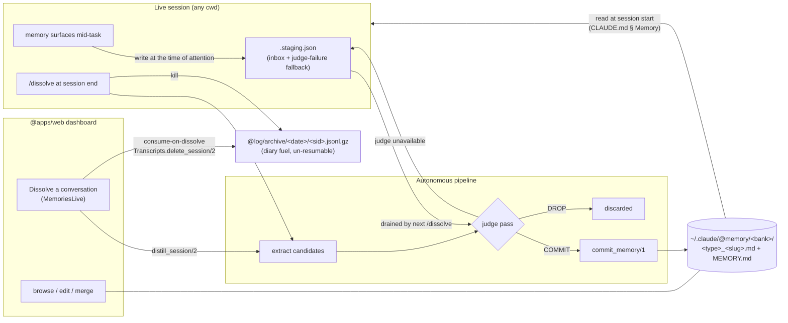
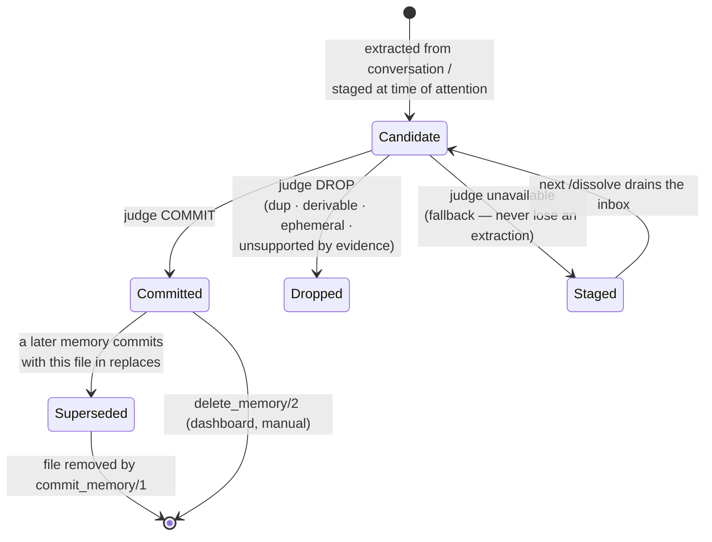
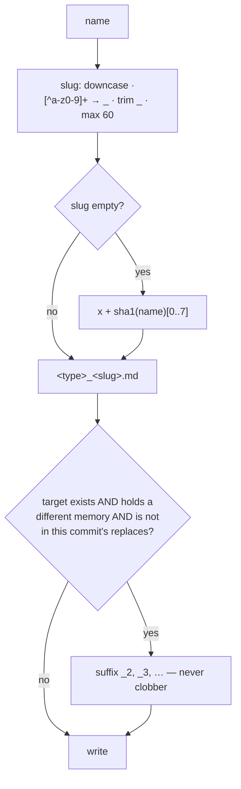
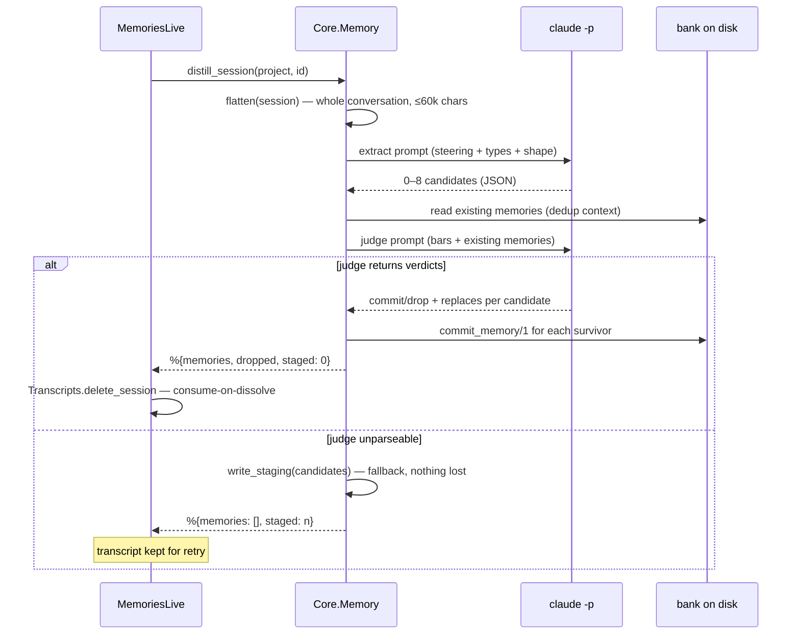
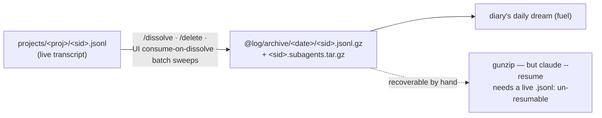

# The Memory System

One bank per working directory under `~/.claude/@memory`. Sessions write memories the moment
they surface, dissolve whole conversations at death, and read their bank back at birth.
No human review anywhere in the loop — verification is a judge pass, and the dashboard is
a viewer/editor, not a gate. `Core.Memory` (`memory.ex`) is the single format authority;
every other writer (the `/dissolve` skill, batch jobs) mirrors it byte-for-byte.

## System overview



Three write paths, one pipeline: everything funnels through **extract → judge → commit**.
The only differences are who extracts (a live session with its own context, or `claude -p`
over a flattened transcript) and who judges (subagents for the skill, a second `claude -p`
call for the dashboard).

## Life of a memory



Judge bars (identical in the skill and `Core.Memory.judge/2`): **durable** (useful in a
future, unrelated session) · **non-derivable** (not recoverable from code/git/CLAUDE.md) ·
**one idea per memory** · **description specific enough to trigger recall** · evidence
supports the claim. Tie-break: _when in doubt, drop_ — with no reviewer downstream, a
missed memory costs less than committed noise.

## Banks and memory files

Bank id = cwd with every non-alphanumeric character replaced by `-` (`sanitize/1`):
`/Users/jlg/GitHub/jgeschwendt/grove` → `-Users-jlg-GitHub-jgeschwendt-grove`.

```
~/.claude/@memory/
├── .staging.json                     # inbox / fallback queue (array of memory maps)
├── _steering.md                      # optional curation guidance (else @default_steering)
└── <bank>/
    ├── MEMORY.md                     # regenerated index — never hand-edited
    ├── <type>_<slug>.md              # one memory per file
    └── _*.md                         # underscore-prefixed files are skipped
```

Memory file serialization (`serialize_memory/1`):

```markdown
---
name: <human-readable title, ≤90 chars>
description: <one-line recall summary, whitespace collapsed>
type: feedback | project | reference | user
source: <session uuid — line omitted if unknown>
---

<body — for feedback/project: the rule, then **Why:**, then **How to apply:**>
```

Filename mechanics (`file_name/1`, `commit_file_name/2`):



`commit_memory/1` then: removes each `replaces` file (bank-local plain filenames only —
`writable?/1` + `Core.Store.component?/1` block traversal and `auto:` banks), writes the
memory, prunes same `bank`+`name` entries from `.staging.json`, and regenerates `MEMORY.md`
— fixed frontmatter header, one line per memory in sorted-filename order:
`- [<name>](<file>) — <description, ≤150 chars>`.

## The two dissolve flows

### Dashboard: `distill_session/2` (one conversation, two `claude -p` calls)



### Session end: the `/dissolve` skill (this session's context, subagent harness)

```mermaid
sequenceDiagram
    participant S as dying session
    participant J as judges ×2 (subagents)
    participant B as banks
    participant A as auditor (subagent)

    S->>S: resolve bank · load steering + inbox
    S->>S: extract candidates (with verbatim evidence quotes)
    par quality judge
        S->>J: candidates + steering → COMMIT/REVISE/DROP
    and dedup judge
        S->>J: candidates + bank path → NEW/DUP/SUPERSEDES
    end
    J-->>S: verdicts (nothing commits on the lead's sole judgment)
    S->>B: commit survivors + drain inbox (mirrors commit_memory/1 exactly)
    S->>A: manifest + format spec
    A-->>S: PASS | FAIL (fix once, re-audit; a 2nd FAIL is reported, never hidden)
    S->>S: drain rules/learn-code.md → rules/*.md
    S->>S: kill — transcript gzip-archived to @log/archive/<date>/
```

The skill's commit step cites `memory.ex` (`serialize_memory/1`, `commit_file_name/2`,
`regen_index/1`, `commit_memory/1`) as its source of truth — on any drift, this code wins.

## Read path

Every session's CLAUDE.md § Memory contract: at start, if a bank matches the cwd
(case-insensitive — the store has casing drift, reuse the existing dir), read its
`MEMORY.md` and treat memories as background context — point-in-time observations, verify
before asserting. Mid-session durable _instructions_ route through the Golden Rule
(artifacts), not memory; memory holds _observations_.

## Bank kinds

| Kind    | Source                                                           | Writable            |
| ------- | ---------------------------------------------------------------- | ------------------- |
| managed | `~/.claude/@memory/<bank>/` — this system                        | yes (`writable?/1`) |
| `auto:` | Claude Code's own `projects/*/memory/` dirs                      | read-only           |
| seeded  | `skills/sandman/memories` corpus, copied once (`.seeded` marker) | as managed          |

Banks whose name starts with `_` or `.` are never targeted; the dashboard skips them.

## What staging still is (and isn't)

`.staging.json` is no longer a review queue. It has exactly two legitimate populations:

1. **Inbox** — memories written at the time of attention by live sessions (cheap, no
   ceremony mid-task). The next `/dissolve` from any session drains them through the
   judge, whatever bank they target.
2. **Fallback** — a dashboard dissolve whose judge call failed parks its candidates here
   instead of losing them; the transcript is kept so the dissolve can be retried.

`merge_memories/2` (dashboard editor) still stages its merged candidate — an interactive
edit the user completes with one click, not an autonomous path. Entry shape mirrors
`read_staging/0`: `{bank, body, description, name, replaces, source, type}`; malformed
entries (no name/bank) are dropped rather than allowed to crash a later commit.

## Retention



Memories are the durable residue; transcripts are compact-deleted (gzip-archived, ~10×
smaller, recoverable, un-resumable). Nothing is ever erased outright.
